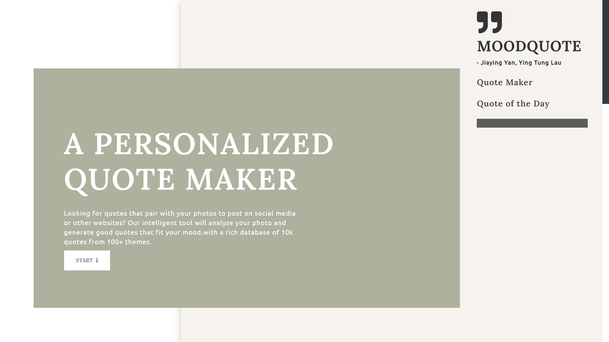
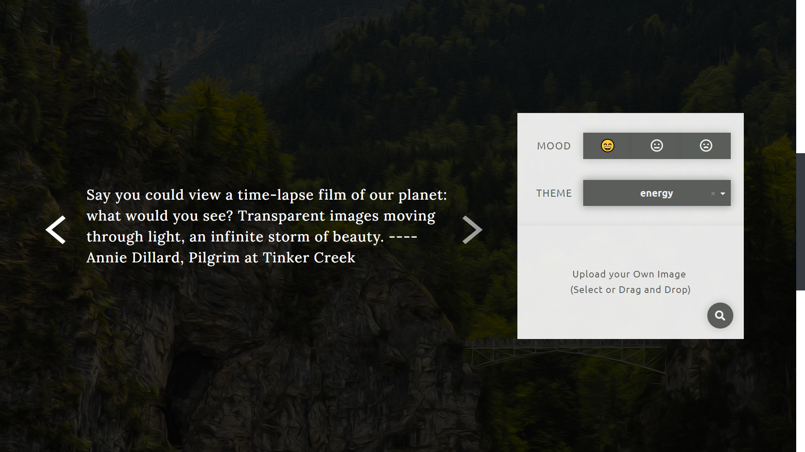
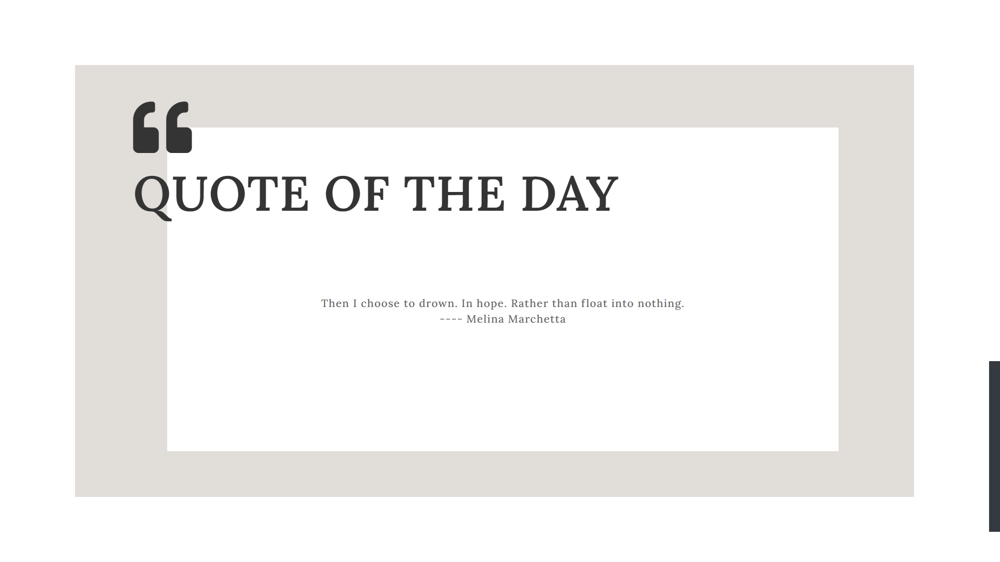

# MOODQUOTE  [](https://opensource.org/licenses/Apache-2.0) 



Looking for quotes that pair with your photos to post on social media or other websites?  Moodquote is a web application that will analyze your photo and generate good quotes that fit your mood.

:crown: Upload an image and select a mood for quotes, then you are just one click away from the quotes! 

:sparkles:  If you want to choose a theme for the quotes, we also have a rich set of tags that you can choose from. 

## Table of Contents

- [About this app](#about-this-app)
  - [Quotes maker](#quotes-maker)
  - [Quote of the day](#quote-of-the-day)
- [Data](#data)
- [Run this app locally](#run-this-app-locally)
- [Run the tests](#run-the-tests)
- [Built with](#built-with)
- [License](#license)
- [Authors](#authors)

## About this app

#### Quotes maker

The main function of this app is to generate quotes by matching image `color`, `mood` and `theme` (optional) with quotes features.

- **Color Analysis:**  colors of the image uploaded by the user will be analyzed with algorithms modified from [`extcolors`](https://github.com/CairX/extract-colors-py) (a Python module for extracting colors from an image) 
- **Feature Matching:** mood and theme selected by the user will be used to match the sentiment and theme tags of quotes




#### **Quote of the day** 

Our app also displays a randomly-picked popular quote every day by using the date as the seed.



## Data

- `all_quotes_w_sentimentalScore.csv`
  - quote text, author, tags, and popularity are from [Goodreads](https://www.goodreads.com/quotes)
  - sentiment tags are generated by sentimental analysis using [`NLTK sentiment Vader`](https://www.nltk.org/_modules/nltk/sentiment/vader.html)

- `color_tag.csv`
  - color and color tags are referenced from [The Meaning Behind Colors](https://medium.com/re-write/the-meaning-behind-colors-decadca7cb15)
  - tags are cleaned by finding synonyms using [`NLTK Wordnet`](https://www.nltk.org/_modules/nltk/corpus/reader/wordnet.html)

## Run this app locally

To get started, clone this repo:


```
git clone https://github.com/sharonytlau/moodquote.git
cd moodquote
```

Install the dependencies:

```
pip install -r requirements.txt
```

Run the app:

```
python app.py
```

and visit http://127.0.0.1:8050/ in your web browser. 

Now, play with it! :rocket:

## Run the tests

To test main algorithms behind the application, run

```
pytest test_app.py
```

## Built with

- [Dash](https://github.com/plotly/dash) - Python framework for web applications
- [Dash Bootstrap Components](https://github.com/facultyai/dash-bootstrap-components) - Layout engine, default styles and high-level components based on Bootstrap

## License

Our app is made available under the  [Apache 2.0 License](https://github.com/sharonytlau/moodquote/blob/master/LICENSE).

## Authors

- **Ying Tung Lau** – [sharonytlau](https://github.com/sharonytlau) – sharonlau@brandeis.edu
  
- **Jiaying Yan** – jiayingyan@brandeis.edu

Feel free to contact us about your user experience. Your precious feedbacks will help us improve our application! :blush:

